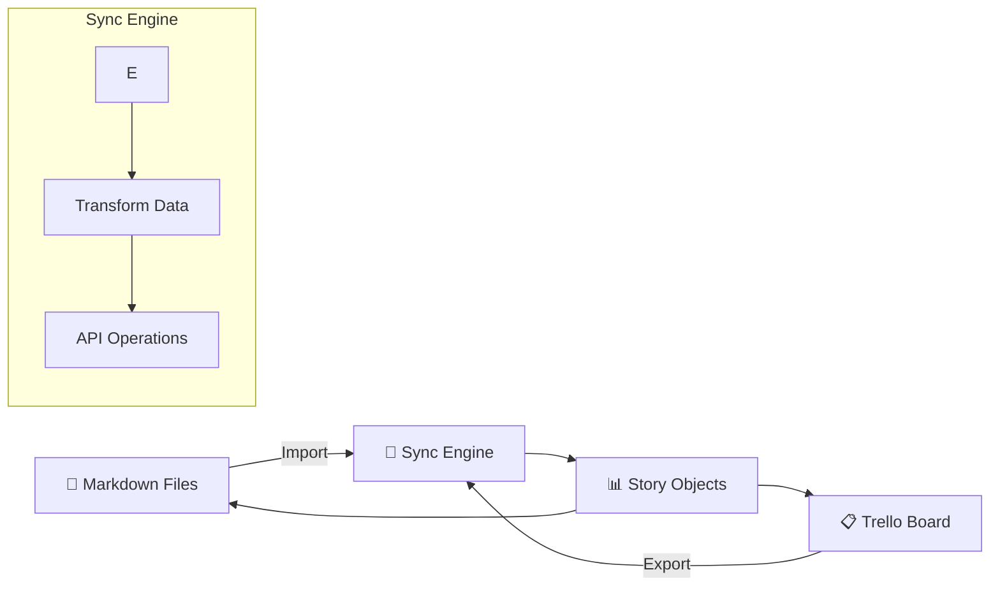

# Trello MD Sync

[](https://www.npmjs.com/package/trello-md-sync)

[](LICENSE)

Sync Trello boards with Markdown stories. Licensed under the MIT License.


## Overview

The latest release introduces a safer, clearer sync model:
- Single entry for md→Trello with create-only enforcement
- Separated formats: Multi-Story for import, Single-Story for export
- Dry-run diagnostics for CI and previewing plans

This tool synchronises Markdown documents and Trello boards so teams can manage work in text while keeping the board current.

## Features

### Core Functionality
- ✅ **Create-only import:** Multi-Story Markdown → Trello board items by Story ID
- ✅ **Read-only export:** Trello board → Single-Story Markdown files
- ✅ **Status mapping:** Backlog, Ready, In progress, In review, Done (with aliases)
- ✅ **Deterministic behavior:** Idempotent operations keyed by Story ID
- ✅ **Dry-run mode:** Preview changes with structured logs for CI gates

### Configuration & Validation
- ✅ **Configuration validation:** Comprehensive validation with clear error messages
- ✅ **Format validation:** Automatic validation of API keys, tokens, and board IDs
- ✅ **Connection testing:** Verify Trello API connectivity before sync operations
- ✅ **Directory management:** Automatic creation and permission validation

## How It Works



**Workflow Overview:**
1. **Parse** markdown files or fetch Trello cards
2. **Transform** data through standardized Story objects
3. **Sync** bidirectionally with conflict resolution

For detailed workflow diagrams, see [WORKFLOW.md](WORKFLOW.md).

### Advanced Features
- ✅ **Enhanced error handling:** Detailed error messages with recovery recommendations
- ✅ **Performance optimization:** Validation caching and concurrent operations
- ✅ **Label management:** Automatic label creation and priority mapping
- ✅ **Member mapping:** Alias support for team member assignments
- ✅ **Flexible filtering:** Filter by list, label, or story ID
- ✅ **TypeScript API:** Full TypeScript support with type definitions
- ✅ **Runnable examples:** Complete examples in the `examples/` directory

## Requirements

- Node.js 18 or newer

## Quick Start

### 1. Install

```bash
npm install trello-md-sync
```

### 2. Setup Configuration

Create a `.env` file with your Trello credentials ([How to get credentials](#how-to-get-trello-credentials)):

```env
# Required
TRELLO_KEY=your_trello_api_key_here
TRELLO_TOKEN=your_trello_token_here
TRELLO_BOARD_ID=your_board_id_here

# Optional
MD_INPUT_DIR=md
MD_OUTPUT_DIR=trello
```

### 3. Start Using

```bash
# Import markdown to Trello
npm run md -- stories/my-stories.md

# Export Trello to markdown  
npm run trello

# Preview changes (dry-run)
npm run md -- stories/my-stories.md --dry-run
```

## Configuration

For detailed configuration options, see [CONFIGURATION.md](CONFIGURATION.md).

### Quick Reference

| Required | Optional |
|----------|----------|
| `TRELLO_KEY` | `MD_INPUT_DIR` |
| `TRELLO_TOKEN` | `MD_OUTPUT_DIR` |
| `TRELLO_BOARD_ID` | `TRELLO_LIST_MAP_JSON` |
| | `MEMBER_ALIAS_MAP_JSON` |
| | `PRIORITY_LABEL_MAP_JSON` |

## Usage

### CLI Commands

```bash
# Import markdown to Trello
npm run md -- stories/my-stories.md

# Export Trello to markdown
npm run trello

# Export single story
npm run trello -- Story-1234

# Preview changes (dry-run)
npm run md -- stories/my-stories.md --dry-run
```

### As a Library

You can use the library functions directly or create custom scripts in your `src/trello/` directory:

#### Option 1: Create custom scripts (Recommended)

Create two files in your `src/trello/` directory:

**`src/trello/md-to-trello.ts`**
```typescript
import { mdToTrello } from "trello-md-sync";
import type { MdToTrelloConfig } from "trello-md-sync";
import dotenv from "dotenv";

// Load environment variables
dotenv.config();

async function main() {
  const config: MdToTrelloConfig = {
    trelloKey: process.env.TRELLO_KEY!,
    trelloToken: process.env.TRELLO_TOKEN!,
    trelloBoardId: process.env.TRELLO_BOARD_ID!,
    mdInputDir: process.env.MD_INPUT_DIR || "./md",
    mdOutputDir: process.env.MD_OUTPUT_DIR || "./trello",
    logLevel: "info",
    dryRun: process.argv.includes("--dry-run"),
    ensureLabels: true
  };

  try {
    const result = await mdToTrello(config);
    console.log(`✅ Import completed: ${result.result.created} created, ${result.result.updated} updated`);
  } catch (error) {
    console.error("❌ Import failed:", error);
    process.exit(1);
  }
}

if (require.main === module) {
  main();
}
```

**`src/trello/trello-to-md.ts`**
```typescript
import { trelloToMd } from "trello-md-sync";
import type { TrelloToMdArgs } from "trello-md-sync";
import dotenv from "dotenv";

// Load environment variables
dotenv.config();

async function main() {
  const config: TrelloToMdArgs = {
    trelloKey: process.env.TRELLO_KEY!,
    trelloToken: process.env.TRELLO_TOKEN!,
    trelloBoardId: process.env.TRELLO_BOARD_ID!,
    mdOutputDir: process.env.MD_OUTPUT_DIR || "./trello"
  };

  try {
    const result = await trelloToMd(config);
    console.log(`✅ Export completed: ${result.written} files exported`);
  } catch (error) {
    console.error("❌ Export failed:", error);
    process.exit(1);
  }
}

if (require.main === module) {
  main();
}
```

Then add these scripts to your `package.json`:

```json
{
  "scripts": {
    "md-to-trello": "npx tsx src/trello/md-to-trello.ts",
    "trello-to-md": "npx tsx src/trello/trello-to-md.ts",
    "dry-run": "npx tsx src/trello/md-to-trello.ts --dry-run"
  }
}
```

#### Option 2: Using library functions directly

```typescript
import { mdToTrello, trelloToMd } from "trello-md-sync";
import type { MdToTrelloConfig, TrelloToMdArgs } from "trello-md-sync";

// Import markdown to Trello
const importResult = await mdToTrello({
  trelloKey: process.env.TRELLO_KEY!,
  trelloToken: process.env.TRELLO_TOKEN!,
  trelloBoardId: process.env.TRELLO_BOARD_ID!,
  mdInputDir: "./md",
  mdOutputDir: "./trello"
});

// Export Trello to markdown
const exportResult = await trelloToMd({
  trelloKey: process.env.TRELLO_KEY!,
  trelloToken: process.env.TRELLO_TOKEN!,
  trelloBoardId: process.env.TRELLO_BOARD_ID!,
  mdOutputDir: "./trello"
});
```

## Examples

### Setting up package.json Scripts

Add these scripts to your `package.json` for easy CLI usage:

```json
{
  "scripts": {
    "md-to-trello": "npx tsx src/trello/md-to-trello.ts",
    "trello-to-md": "npx tsx src/trello/trello-to-md.ts",
    "dry-run": "npx tsx src/trello/md-to-trello.ts --dry-run"
  },
  "devDependencies": {
    "trello-md-sync": "^0.1.0"
  }
}
```

### Project Structure Example

```
your-project/
├── .env                    # Trello credentials
├── package.json           # Scripts configuration
├── src/
│   └── trello/            # Custom sync scripts
│       ├── md-to-trello.ts
│       └── trello-to-md.ts
├── md/                    # Input markdown files
│   └── multi-story.md     # Multi-story markdown file
└── trello/                # Exported markdown files
    └── single-story.md    # Single-story markdown files
```

### Complete Working Examples

The `src/trello/` directory contains ready-to-run demonstrations:

- **`src/trello/md-to-trello.ts`** — Import markdown stories to Trello
- **`src/trello/trello-to-md.ts`** — Export Trello cards to markdown
- **`package.json`** — Sample scripts configuration
- **`.env`** — Environment variables configuration

To use the examples:

```bash
# Setup your project
mkdir my-trello-sync && cd my-trello-sync
npm init -y

# Install dependencies
npm install trello-md-sync dotenv tsx typescript

# Create directory structure
mkdir -p src/trello md trello

# Configure environment
cat > .env << EOF
TRELLO_KEY=your_trello_api_key_here
TRELLO_TOKEN=your_trello_token_here
TRELLO_BOARD_ID=your_board_id_here
MD_INPUT_DIR=md
MD_OUTPUT_DIR=trello
EOF

# Create the sync scripts (copy from examples above)
# Then run
npm run md-to-trello     # Import markdown to Trello
npm run trello-to-md     # Export Trello to markdown
```

## Troubleshooting

For detailed troubleshooting information, see [TROUBLESHOOTING.md](TROUBLESHOOTING.md).

### Quick Debug

```bash
# Enable debug logging
LOG_LEVEL=debug npm run md

# Preview changes without executing
npm run md -- stories/my-stories.md --dry-run
```

### Using trello:story

```bash
npm run trello:story -- Story-1234
```

- Prompts for Trello key, token and board ID if env vars `TRELLO_KEY`, `TRELLO_TOKEN` and `TRELLO_BOARD_ID` are not set
- Generates markdown for the specified story ID under `stories/` by default
- Accepts `Story-XXXX` via positional arg or `--story Story-XXXX`
- Overrides the output directory via positional path or `--output ./custom-dir`

Parameter rules:

- `Story-ID` positional detection checks for values that match `/^Story-/i`. If omitted, all stories are exported.
- The first remaining positional argument is treated as the output directory. Without it, files are written to `./stories`.
- Flags `--story=value` / `--output=value` are equivalent to their spaced counterparts.

Examples:

```bash
npm run trello -- Story-0456
npm run trello ./stories/out-story -- Story-0112
npm run trello:story -- Story-0112 ./stories/single
npm run trello:story -- --story Story-0112 --output ./stories/single
```

## How to Get Trello Credentials

### API Key and Token

1. Visit [https://trello.com/app-key](https://trello.com/app-key)
2. Copy your **API Key** (32-character hex string)
3. Click **"Token"** link and authorize the app
4. Copy the generated **Token** (64-character hex or ATTA- prefixed)

### Board ID

**From Browser URL:**
- Open your Trello board
- Copy the ID from URL: `trello.com/b/BOARD_ID/board-name`

**Using API:**
```bash
curl "https://api.trello.com/1/members/me/boards?key=YOUR_KEY&token=YOUR_TOKEN"
```

## API Reference

### mdToTrello(trelloKey: string, trelloToken: string, boardId: string, sourcePath: string)

Import Multi-Story markdown files from a directory into a Trello board. Create-only and idempotent by Story ID.

- trelloKey: Trello API key
- trelloToken: Trello API token
- boardId: Trello board ID
- sourcePath: Path to directory containing markdown files

### trelloToMd(trelloKey: string, trelloToken: string, boardId: string, outputPath?: string)

Export Trello board items to Single-Story markdown files. Defaults to writing into `./stories` when no output path is provided.

- trelloKey: Trello API key
- trelloToken: Trello API token
- boardId: Trello board ID
- outputPath (optional): Output directory path. Defaults to './stories'

## Story File Formats

Two complementary formats are supported:

- Multi-Story files (for `mdToTrello()` import)
- Single-Story files (for `trelloToMd()` export)

### Multi-Story format (md→Trello)

Sections represent status. Each story must include `- Story:` with Story ID and description. Optional fields include acceptance criteria, priority, labels, and assignees.

```
## Backlog

- Story: STORY-1101 Refine Trello Markdown Parser for Multi-Story Imports
  Description: Update parseBlockStory() and related utilities to fully support the revised Todo-list standard, capture source locations, and ensure status normalization integrates with the extended list map.
  Acceptance_Criteria:
    - [ ] Parser extracts Story ID, labels, assignees, priority, and acceptance criteria for every block story
    - [ ] Missing Story ID entries trigger structured errors containing file and line metadata
    - [ ] Normalized statuses resolve via TRELLO_LIST_MAP_JSON with strictStatus guardrails
    - [ ] Unit tests cover mixed H2 and - Story: inputs with ≥90% branch coverage
  Priority: High
  Labels: [sync, trello, parser]
  Assignees: [backend]

## Ready

- Story: STORY-1102 Enhance TrelloProvider for Checklist, Label, and Member Sync
  Description: Extend TrelloProvider to ensure checklist creation, label alignment, and member assignment comply with the new import pipeline, including retries and detailed logging.
  Acceptance_Criteria:
    - [ ] Checklist synchronization recreates Todos checklist when acceptance criteria change
    - [ ] Label and member lookups cache Trello IDs and log unresolved entries as warnings
    - [ ] findItemByStoryIdOrTitle() prefers custom field matches and only warns on title fallbacks
    - [ ] Provider unit tests mock Trello REST endpoints covering success, retry, and failure paths
  Priority: High
  Labels: [sync, trello, provider]
  Assignees: [backend]

## In review

- Story: STORY-1103 Upgrade mdToTrello Import Flow with Differential Updates
  Description: Refactor mdToTrello() to separate create/update/move/checklist flows, respect dry-run planning output, and honor strict status validation before API calls.
  Acceptance_Criteria:
    - [ ] Dry-run emits created/updated/moved/checklistChanges summaries without mutating Trello
    - [ ] Live execution updates card name, desc, list, checklist, labels, and members atomically per story
    - [ ] writeLocal option renders single-story markdown snapshots for each processed story
    - [ ] Integration tests confirm idempotent runs on examples/md/test-todo-list.md
  Priority: High
  Labels: [sync, trello, importer]
  Assignees: [backend]
```

Rules:
- Allowed headings: Backlog, Ready, In progress, In review, Done, Design, To-Do, Doing, Code Review, Testing
- Aliases: `To do → Ready`, `In Progress/in progress → In progress`
- Unrecognised headings map to Backlog
- Story ID must be unique and embedded in the story title (format: `STORY-XXXX Title`)
- Existing IDs in Trello board are skipped (no update, no delete)
- Within a file, duplicate IDs: only the first entry is honoured; later duplicates are skipped
- `Description:` content is free-form Markdown and preserved verbatim
- `Acceptance_Criteria:` uses checkbox format for tracking completion status
- `Priority:`, `Labels:`, and `Assignees:` are optional metadata fields
- Labels should be formatted as arrays: `[label1, label2, label3]`
- Assignees should be formatted as arrays: `[user1, user2, user3]`

### Single-Story format (Trello→md, read-only)

Each file contains exactly one story and includes structured sections for all story metadata.

```
## Story: STORY-1101 Refine Trello Markdown Parser for Multi-Story Imports

### Story ID
STORY-1101

### Status
Backlog

### Description
Update parseBlockStory() and related utilities to fully support the revised Todo-list standard, capture source locations, and ensure status normalization integrates with the extended list map.

### Acceptance Criteria
- [ ] Parser extracts Story ID, labels, assignees, priority, and acceptance criteria for every block story
- [ ] Missing Story ID entries trigger structured errors containing file and line metadata
- [ ] Normalized statuses resolve via TRELLO_LIST_MAP_JSON with strictStatus guardrails
- [ ] Unit tests cover mixed H2 and - Story: inputs with ≥90% branch coverage

### Priority
Priority: High

### Labels
sync, trello, parser

### Assignees
backend
```

This format is generated by export and must not be used for import. The exported files include all available metadata from the Trello card, including acceptance criteria as checkboxes, priority level, and associated labels.

### Status mapping

`mdToTrello()` normalises headings/status strings using the logic in `src/markdown-to-trello.ts`:

| Input heading / status | Stored status |
| --- | --- |
| `Backlog` | `Backlog` |
| `Ready`, `To do`, `Todo` | `Ready` |
| `In progress`, `In Progress` | `In Progress` |
| `In review` | `In review` |
| `Done` | `Done` |
| Any other heading | Treated as `Backlog` |

## Import and Export Behaviour

- md→Trello (import)
  - Input: Multi-Story files only
  - Action: Create new items when `story id` does not exist in Trello board; skip otherwise
  - No updates or deletes from Markdown
- Trello→md (export)
  - Output: Multiple Single-Story files, each with `### Story ID`
  - Read-only: do not feed these files back into import

## Limitations and caveats

- The importer is create-only. Updating or deleting existing Trello cards must be done in Trello.
- Exporters overwrite files with the same name inside the target directory.
- All commands expect `TRELLO_KEY`, `TRELLO_TOKEN` and `TRELLO_BOARD_ID` to be available; the Trello token must allow board read/write access.
- `story id` matching is case-insensitive, but duplicates in the same markdown file keep only the first occurrence.

## Story ID

- Matching uses Story ID only; titles never overwrite existing items
- If an item with the same ID exists in Trello board: skip
- Missing `story id`: strictly skipped and logged with file name, start line, and title
- Missing ID plus exact title match triggers an additional "Possible title duplicate" warning

## Dry-run and Diagnostics

Use dry-run to preview planned operations, with logs covering create plans, skip reasons, missing IDs, duplicates, and unknown keys. Ideal for CI gates and author feedback.

## Deprecated

- `src/story-to-trello-item.ts` is deprecated as an import entry. Use `src/markdown-to-trello.ts` via the CLI or library.


## Notes

- Requires Node.js 18+
- Runs in Node.js/server environments, not in the browser

## Feedback

If you encounter any problems during use, or have suggestions for improvement, feel free to contact me:

- 🌐 Personal Website: [https://nzlouis.com](https://nzlouis.com)
- 📝 Blog: [https://blog.nzlouis.com](https://blog.nzlouis.com)
- 💼 LinkedIn: [https://www.linkedin.com/in/ailouis](https://www.linkedin.com/in/ailouis)
- 📧 Email: nzlouis.com@gmail.com

You are also welcome to submit feedback directly in [GitHub Issues](https://github.com/nzlouislu/trello-md-sync/issues) 🙌

---

If you find this tool helpful, please consider giving it a ⭐️ Star on [GitHub](https://github.com/nzlouislu/trello-md-sync) to support the project, or connect with me on [LinkedIn](https://www.linkedin.com/in/ailouis).
